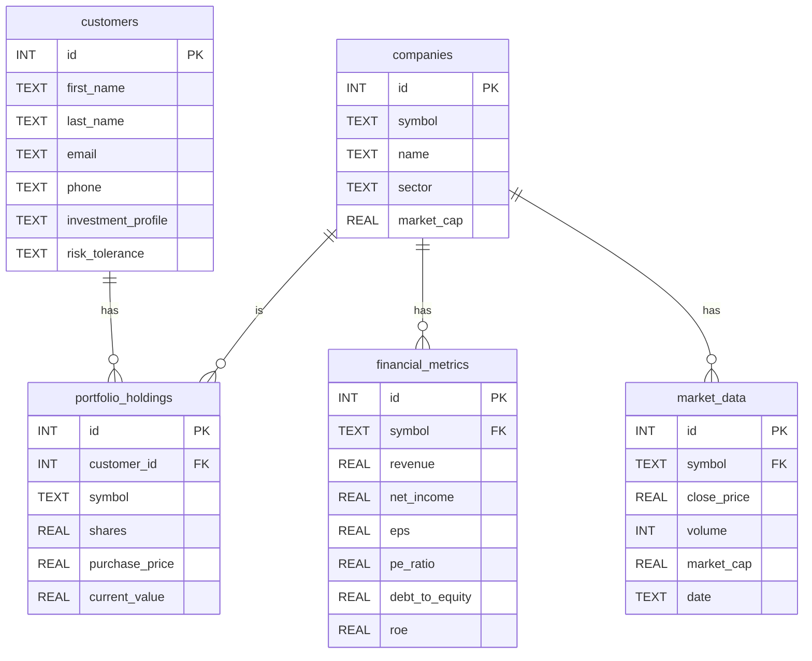

```mermaid
erDiagram
    customers {
        INT id PK
        TEXT first_name
        TEXT last_name
        TEXT email
        TEXT phone
        TEXT investment_profile
        TEXT risk_tolerance
    }

    portfolio_holdings {
        INT id PK
        INT customer_id FK
        TEXT symbol
        REAL shares
        REAL purchase_price
        REAL current_value
    }

    companies {
        INT id PK
        TEXT symbol
        TEXT name
        TEXT sector
        REAL market_cap
    }

    financial_metrics {
        INT id PK
        TEXT symbol FK
        REAL revenue
        REAL net_income
        REAL eps
        REAL pe_ratio
        REAL debt_to_equity
        REAL roe
    }

    market_data {
        INT id PK
        TEXT symbol FK
        REAL close_price
        INT volume
        REAL market_cap
        TEXT date
    }

    customers ||--o{ portfolio_holdings : "has"
    companies ||--o{ portfolio_holdings : "is"
    companies ||--o{ financial_metrics : "has"
    companies ||--o{ market_data : "has"
```
