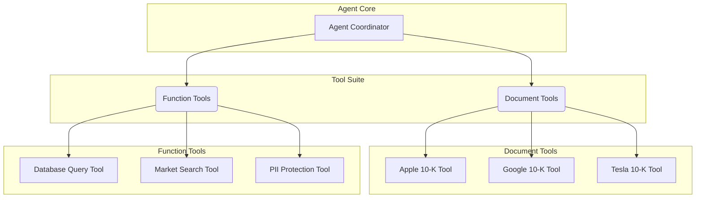

```mermaid
graph TD
    subgraph Agent Core
        A[Agent Coordinator]
    end

    subgraph Tool Suite
        B(Document Tools)
        C(Function Tools)
    end

    subgraph Document Tools
        B1[Apple 10-K Tool]
        B2[Google 10-K Tool]
        B3[Tesla 10-K Tool]
    end

    subgraph Function Tools
        C1[Database Query Tool]
        C2[Market Search Tool]
        C3[PII Protection Tool]
    end

    A --> B
    A --> C

    B --> B1
    B --> B2
    B --> B3

    C --> C1
    C --> C2
    C --> C3
```
